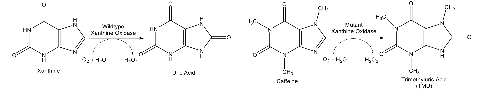
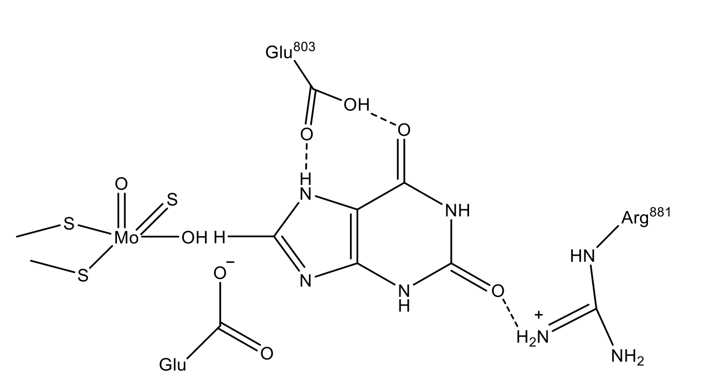

Dexter Antonio

CHEN4800: Protein Engineering

Protein Project Proposal Assignment

May 1st, 2017

**Background.** Caffeine is the most consumed psychoactive stimulant in the world. It is naturally present in the world's two most popular beverages, tea and coffee and is the main reason for their vast appeal 1 . It is also an additive to over 150 food products and 570 drink products such as soft drinks and energy drinks. The widespread consumption of caffeine is expected to continue and even increase 2.

Overconsumption of caffeine has numerous negative health effects. Caffeine consumption in the range 400-700 mg per day has been correlated to changes in sleep patterns, higher blood pressure, heart papulations, anxiety, irritability and restlessness 23. Caffeine can also trigger miscarriages in pregnant women 4. Excessive consumption of caffeine pills or energy drinks cause caffeine overdoses, which are sometimes fatal 5. Caffeine consumed by nursing mothers is transferred to their breast milk, sometimes resulting in caffeine overdoses in their children 6.

Since caffeine consumption exceeding certain levels has serious health effects, moderating one's consumption of caffeine is important. Although products with added caffeine frequently report the total caffeine content, the caffeine levels in drinks prepared from tea and coffee are not usually reported and vary significantly between different batches. One study found that the caffeine content of store bought coffee ranged from 48-317 mg per serving 4. This large variation and lack of reporting makes it difficult for consumers to moderate their caffeine indicate and complicates epidemiology studies that attempt to make correlations between caffeine consumption and various diseases 4. The reason that caffeine content of coffee and tea is rarely reported stems from the difficulty and expense in determining caffeine content 6.

Currently, there is no rapid, analytical, self-contained test for the determination of caffeine levels in caffeinated beverages or biological fluids, such as breast milk or blood 6. The standard laboratory analytical method for caffeine detection is UV-VIS-HPLC chromatography. This technique lacks portability and requires extensive laboratory training to utilize. Colorimetric methods for caffeine detection have been developed. Although these are rapid and selective and do not require the large capital investment required by HPLC chromatography, they still require the use of a separate UV-Vis instrument and are usually imprecise.

An enzymatic-electrochemical biosensor with high selectivity of caffeine would be an effective way to measure the caffeine in consumer beverages and bodily fluids. Enzymatic-electrochemical biosensors are already in widespread use in the form of glucose meters. They are used by diabetics to get accurate readings of their blood glucose levels. Glucose meters use tests strips that contain immobilized glucose oxidase, that oxidizes glucose and generates hydrogen peroxide. The hydrogen peroxide can then be detected electrochemically, generating an electoral signal which is measured by the sensor and converted into a glucose value. Although colorimetric methods for blood glucose levels exist, method for glucose detection via UV-Vis spectroscopy have long been surpassed by electrochemical methods due to the accuracy of the reading, the ease of conducting the test and the low of cost of test strips 7. If a protein could be designed that selectively oxidizes caffeine and produces hydrogen peroxide in the process, then a caffeine biosensor could be created that utilizes the same, nearly perfected, electrochemical system utilized by insulin meters.

Xanthine oxidase (XO) is one of the most widely studied oxidase enzymes8. It selectivity oxidizes xanthine to uric acid and produces hydrogen peroxide during the oxidation. Xanthine oxidase is one of the forms of xanthine oxidoreductase (XOR) the other being xanthine dehydrogenase (XDH). Both forms of XOR catalyze the oxidation of xanthine to uric acid but XO uses oxygen as an electron acceptor whereas XDH uses NAD+. XDH can be reversible or irreversibly converted into XO by proteolysis or the formation of cystine bonds respectively 9. Since the XO form produces hydrogen peroxide, which is essential for electrochemical assay, this form of XOR will be used. The mechanism for the oxidation reaction and active site of XO has been extensively studied 9. Xanthine is similar in structure to caffeine; the two compounds differ only in that three of caffeine's nitrogens are methylated (figure 1). The similarity of the structures of xanthine mean that it should be possible to design a mutant XO that is able to selectively oxidize caffeine to trimethyluric acid and produce hydrogen peroxide in the process. An enzyme appropriately named caffeine dehydrogenase has been identified which uses the cofactor CoA to catalyze the hydrolysis of caffeine to trimethyluric acid, indicating the desired reaction is achievable via an enzymatic catalysts10. The substrate specificity of XO can be changed through site directed mutagenesis. Figure 1 shows the reaction catalyzed by native xanthine oxidase and the one that will hopefully be catalyzed by one of the mutant XO enzymes.

**Figure 1.** Reaction catalyzed by wildtype xanthine oxidase and the reaction that will hopefully be catalyzed by one of the mutant xanthine oxidase enzymes.

**Site directed mutagenesis and expression of xanthine oxidase.** Previously, Yamaguchi et al. expressed human XOR recombinantly in _E. Coli_, performed site directed mutagenesis on XOR and demonstrated with X-Ray crystallography that the recombinantly expressed protein had a secondary and tertiary structure similar to XOR expressed in a mammalian organism 11. The procedure described in their study will be replicated, with the exception that different mutations will be made using the same standard techniques.

**Measuring catalytic activity of mutant enzymes.** The kinetic parameters for the conversion of xanthine to uric acid and caffeine to TMU will be measured for the wildtype and each mutant enzyme.The aromatic five membered ring of caffeine and xanthine have a maximal UV absorbance around 295 nm. The oxidation of caffeine to TMU and xanthine to uric acid destroys the aromaticity of this system, so that the products of the oxidation do not absorb light in the UV region. Thus, by monitoring the absorption at 295 nm with time it is possible to measure the rate of substrate consumption so that the kinetic parameters of the mutant enzyme can be determined. The oxygen concentration of the solution can be varied by bubbling through nitrogen gas mixed with various amounts of oxygen.

**Sites of mutagenesis.** The purpose of the site directed mutagenesis experiments are to develop a mutant XO enzyme that is able to oxidase caffeine but does not oxidase xanthine. In order generate only the XO form of XOR the mutation W335A will be made, which has been shown to fix in its XO form 9. For the rest of this proposal the W335A mutant will be referred to as the wildtype enzyme. The enzymes most important for the substrate specificity of this enzyme are located in the active site of the enzymes. Extensive mechanistic studies of mammalian (human, rat and bovine) XO have identified the amino acids that are located in the active site and the mechanism by which the enzyme oxidizes xanthine 9. The substrate binding of xanthine in the active site, prior to the oxidation occurring is shown in figure 2.

  **Figure 2** Active site of xanthine oxidase binding to xanthine 

 Due to minor sequence differences between human, rat and bovine XO the amino acid numbering is species dependent. Since human XO will be used for these experiments, the human numbering scheme will be used in the remainder of this proposal. The mutations will attempt to "open up" the active site to accommodate the added steric bulk of the methyl groups on the caffeine substrate. The residue E803 (in rat XO the equivalent residue is E802) is involved in hydrogen bonding to the protonated amine in xanthine's five membered ring. Since this amine is methylated in caffeine the same stabilizing, hydrogen bonding interaction cannot occur. Therefore, mutating E803 will be the main target in changing the substrate specificity of the enzyme. Past mutagenesis experiments on human XO have already indicated that mutations at this residue change the substrate specificity of the enzyme without significantly altering its secondary structure 11. The E803 residue also hydrogen bonds to an amide carboxyl group on xanthine. Caffeine also contains this group so, to keep this stabilizing interaction, E803 will only be mutated to amino acids capable of hydrogen bonding. The following mutations will be performed, and the catalytic activity of the mutant enzymes to both substrates will be measured: E803S, E803T, E803C and E803M. There is also a possibility that there are some unfavorable steric interactions between R881 (rat equivalent R880) and caffeine so this will be mutated to lysine in an attempt to allow the enzyme to catalyze caffeine, while keeping the stabilizing hydrogen bonding interaction between the amine and the purines' amide. If the R881K is favorable then this mutation will be combined with other favorable E802 mutations to produce another set of mutants.

**Peroxide detection experiments.** The end goal of this mutagenesis study is to produce an enzyme that is able to oxidize caffeine and produce hydrogen peroxide in the process, which can then be electrochemically detected. For convenience, rather than detecting the formation of hydrogen peroxide electrochemically, the generation of hydrogen peroxide will be demonstrated with an Amplex® Red hydrogen peroxide assay kit. Once the ability of the mutant enzyme to oxidase caffeine and produce hydrogen peroxide is demonstrated, additional work will be done on immobilizing the protein and integrating it into an electrochemical system.

**Intellectual Merit.** The intellectual merit of this study is that it will determine how the certain mutations effect the catalytic activity and substrate specificity of xanthine oxidase. Understanding this will allow for a greater understanding of the structure-function relationship of the amino acids in the active site of XO. This will improve our knowledge of the human purine metabolism9. The mutagenesis experiments will demonstrate how site directed mutagenesis can be used to engineer the substrate specificity of an enzyme.

**Broader Impact.** The broader impact of this study will be to set the groundwork for the development of a rapid, analytical, self-contained biosensor that could be used to determine the caffeine content in consumer beverages and human breast milk, and blood. The rapid quantification of caffeine content in coffee and tea would allow for the reporting of their caffeine content to become more common, and allow consumers to ensure that the amount of caffeine consumption remains within safe levels. An easy to use instrument to detect the caffeine levels in breast milk, would allow nursing mothers to ensure that they are not supplying their babies with unsafe levels of caffeine. The convenient quantification of caffeine in blood would allow for epidemiologist to do large scale studies correlating caffeine blood levels to diseases and allow for doctors to rapidly identify caffeine overdoses. The development of a mutant XO capable of oxidizing caffeine would be an essential first step for the development of a biosensor that would help to mitigate the harm caused by the most widely consumed drug.

**References**

1. Nehlig, A., Daval, J.-L. & Debry, G. Caffeine and the central nervous system: mechanisms of action, biochemical, metabolic and psychostimulant effects. _Brain Res. Rev._ **17,** 139–170 (1992).

2. Mohanty, S. K., Yu, C. L., Gopishetty, S. & Subramanian, M. Validation of Caffeine Dehydrogenase from _Pseudomonas_ sp. Strain CBB1 as a Suitable Enzyme for a Rapid Caffeine Detection and Potential Diagnostic Test. _J. Agric. Food Chem._ **62,** 7939–7946 (2014).

3. Fredholm, B. B., Bättig, K., Holmén, J., Nehlig, A. & Zvartau, E. E. Actions of Caffeine in the Brain with Special Reference to Factors That Contribute to Its Widespread Use. _Pharmacol. Rev._ **51,** (1999).

4. Ludwig, I. A. _et al._ Variations in caffeine and chlorogenic acid contents of coffees: what are we drinking? _Food Funct._ **5,** 1718–1726 (2014).

5. Kerrigan, S. & Lindsey, T. Fatal caffeine overdose: Two case reports. _Forensic Sci. Int._ **153,** 67–69 (2005).

6. Mohanty, S. K., Yu, C. L., Gopishetty, S. & Subramanian, M. Validation of Caffeine Dehydrogenase from Pseudomonas sp. Strain CBB1 as a Suitable Enzyme for a Rapid Caffeine Detection and Potential Diagnostic Test. doi:10.1021/jf501598c

7. Ginsberg, B. H. Factors Affecting Blood Glucose Monitoring: Sources of Errors in Measurement. _J. Diabetes Sci. Technol. J Diabetes Sci Technol_ **33,** 903–913 (2009).

8. _Biosensing for the 21st Century_. **109,** (Springer Berlin Heidelberg, 2008).

9. Nishino, T., Okamoto, K., Eger, B. T., Pai, E. F. & Nishino, T. Mammalian xanthine oxidoreductase - Mechanism of transition from xanthine dehydrogenase to xanthine oxidase. _FEBS J._ **275,** 3278–3289 (2008).

10. Madyastha, K. M., Sridhar, G. R., Vadiraja, B. B. & Madhavi, Y. S. Purification and Partial Characterization of Caffeine Oxidase—A Novel Enzyme from a Mixed Culture Consortium.

11. Yamaguchi, Y., Matsumura, T., Ichida, K., Okamoto, K. & Nishino, T. Human Xanthine Oxidase Changes its Substrate Specificity to Aldehyde Oxidase Type upon Mutation of Amino Acid Residues in the Active Site: Roles of Active Site Residues in Binding and Activation of Purine Substrate. (2007). doi:10.1093/jb/mvm053